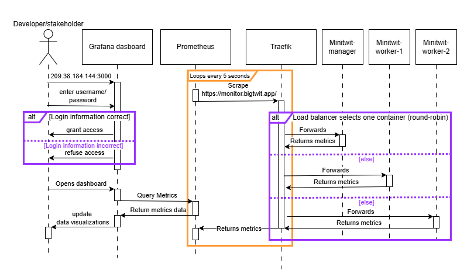
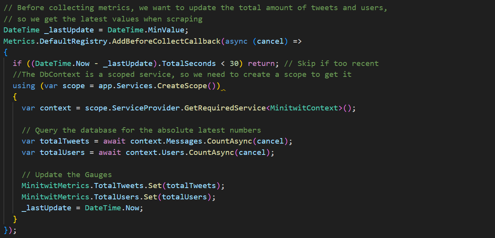

## Monitor
Under here is a sequence diagram of the process of collecting, forwarding, and visualizing application metrics in the monitoring system.

To ensure we do not leak information on our metrics of Minitwit, we have set a username and password on Grafana, that is automatically set on creation. In addition to this, only the Monitor's droplet IP adress is whitelisted to scrape https://monitor.bigtwit.app/, done via Traefik, so no other attacker would be able to access this information.

On this metrics endpoint we use `app.UseHttpMetrics();` , that out of the box, write things to the endpoint like total amount of HTTP requests recieved, the duration of these requests, and much HTTP specific metrics. In addition to this, we added 2 "gauges" to the metrics, that showed the amount of tweets and users the app has. This data is cached, so if another metrics request is recieved in less than 30 seconds, we re-use the old data for tweets, and followers. This is done to not overwork the database.

As can be seen in the diagram, Traefik load balances between each container, which creates this fluctuating graph, that can be seen in the dashboard under here, due to Prometheus not knowing exactly what container it has scraped, and can therefore not make an average. 

*REMEMBER TO ADD TO WRITE A SECTION THAT COVERS WHAT WE SHOULD HAVE DONE WITH PROMETHEUS!!!*
*We are missing what to do to fix it in Docker swarm* 

*Remember to write about how changing to the swarm destroyed our old way of monitoring*

### Dashboard
To see the dashboard, go to [46.101.69.11:3000](46.101.69.11:3000) , where the dashboard + logs can be viewed. The credentials is specified in the post made by Helge.

*WRITE MORE ABOUT THE DASHBOARD!!!*
